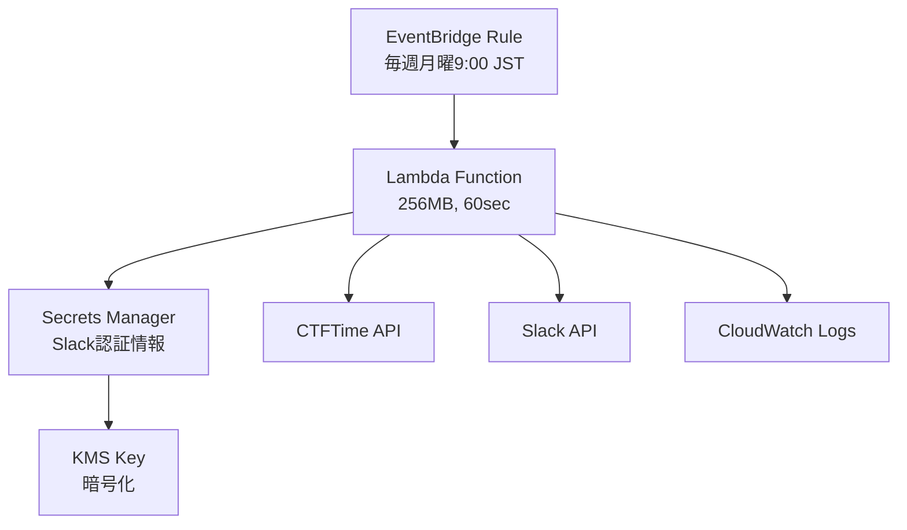

# add-terraform-template

## やること

- lambda_function.py をホストする Lambda 関数を構築する Terraform テンプレートファイルを追加する。

## 目的

- CTFTime のイベント情報を定期的に取得し、Slack に通知する Lambda 関数のインフラストラクチャを、Terraform を使って自動的にプロビジョニングできるようにする。
- セキュアな環境変数管理とスケーラブルな実行環境を構築する。

## アーキテクチャ



## 技術仕様

### AWS リソース

- **リージョン**: ap-northeast-1
- **Lambda 関数**:
  - ランタイム: Python 3.12
  - メモリ: 256MB
  - タイムアウト: 60 秒
  - 環境変数管理: AWS Secrets Manager

### スケジュール

- 実行頻度: 毎週月曜 9:00 JST
- トリガー: Amazon EventBridge (CloudWatch Events)

### セキュリティ

- Slack 認証情報は Secrets Manager で管理
  - OAuth Token
  - Target Channel ID
- IAM ロールは最小権限原則に従って設定
- KMS による暗号化の利用

## デプロイ方法

### 環境変数の設定

Slack 認証情報は機密情報のため、環境変数として設定します：

```bash
# Linux/macOS
export TF_VAR_slack_oauth_token="xoxb-..."
export TF_VAR_target_channel_id="C..."

# Windows PowerShell
$env:TF_VAR_slack_oauth_token="xoxb-..."
$env:TF_VAR_target_channel_id="C..."
```

### Terraform の実行

```bash
# 初期化
cd terraform
terraform init

# 実行計画の確認
terraform plan

# インフラのデプロイ
terraform apply
```

## 注意点

- Secrets Manager の料金が発生するため、開発環境では環境変数を直接設定することも検討する
- Lambda 関数のデプロイメントパッケージには`requests`と`boto3`ライブラリを含める必要がある
- タイムゾーンの設定（JST）に注意が必要
- Slack 認証情報は環境変数`TF_VAR_slack_oauth_token`と`TF_VAR_target_channel_id`として設定する必要がある
